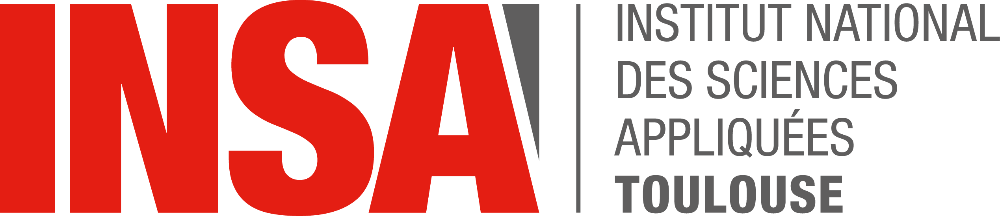

<a name="readme-top"></a>

# Exploratory analysis and dataviz

<!-- PROJECT SHIELDS -->

[![Contributors][contributors-shield]][contributors-url]

<!-- PROJECT LOGO -->
<br />
<div align="center">
  <a href="https://jodorganistaca/exploratory_analysis_dataviz">
    
  </a>
   <br />
   <br />

  <h3 align="center"> M2- 2022- Analyse exploratoire et visualisation de donnees </h3>

  <p align="center">
    An README file explaining all the details related to this project !
    <br />
    <a href="https://github.com/jodorganistaca/exploratory_analysis_dataviz"><strong>Explore the docs »</strong></a>
    <br />
    <br />
    <a href="https://github.com/jodorganistaca/exploratory_analysis_dataviz">View Demo</a>
    ·
    <a href="https://github.com/jodorganistaca/exploratory_analysis_dataviz/issues">Report Bug</a>
    ·
    <a href="https://github.com/jodorganistaca/exploratory_analysis_dataviz/issues">Request Feature</a>
  </p>
</div>


<!-- TABLE OF CONTENTS -->
<details>
  <summary>Table of Contents</summary>
  <ol>
    <li>
      <a href="#about-the-project">About The Project</a>
      <ul>
        <li><a href="#built-with">Built With</a></li>
      </ul>
    </li>
    <li>
      <a href="#About-dataset">About Dataset </a>
      <ul>
        <li><a href="#Content">Content</a></li>
      </ul>
    </li>
    <li>
      <a href="#getting-started">Getting Started</a>
      <ul>
        <li><a href="#prerequisites">Prerequisites</a></li>
        <li><a href="#installation">Installation</a></li>
      </ul>
    </li>
    <li><a href="#usage">Usage</a></li>
    <li><a href="#roadmap">Roadmap</a></li>
    <li><a href="#contributing">Contributing</a></li>
    <li><a href="#license">License</a></li>
    <li><a href="#contact">Contact</a></li>
    <li><a href="#acknowledgments">Acknowledgments</a></li>
  </ol>
</details>


<!-- ABOUT THE PROJECT -->
## About The Project


la problématique....... 

<p align="right">(<a href="#readme-top">back to top</a>)</p>


### Built With

This section should list any major Language/IDE used in this project. 

* [![R][R.js]][R-url]
* [![Rstudio][Rstudio.js]][Rstudio-url]


<p align="right">(<a href="#readme-top">back to top</a>)</p>


<!-- About-dataset -->
## About-dataset

The used dataset contains 2021-2022 football player stats per 90 minutes.

<p>(<a href="#https://www.kaggle.com/datasets/vivovinco/20212022-football-player-stats">Dataset Link</a>)</p>


### Content

+2500 rows and 143 columns.
Columns' description are listed below.

* Rk : Rank
* Player : Player's name
* Nation : Player's nation
* Pos : Position
* Squad : Squad’s name
* Comp : League that squat occupies
* Age : Player's age
* Born : Year of birth
* MP : Matches played
* Starts : Matches started
* Min : Minutes played
* Goals : Goals scored or allowed
* ... (Check the dataset link)

<p align="right">(<a href="#readme-top">back to top</a>)</p>


<!-- GETTING STARTED -->
## Getting Started

This is an example of how you may give instructions on setting up your project locally.
To get a local copy up and running follow these simple example steps.

### Prerequisites

This is an example of how to list things you need to use the software and how to install them.
* npm
  ```sh
  npm install npm@latest -g
  ```

### Installation

_Below is an example of how you can instruct your audience on installing and setting up your app. This template doesn't rely on any external dependencies or services._

1. Get a free API Key at [https://example.com](https://example.com)
2. Clone the repo
   ```sh
   git clone https://github.com/your_username_/Project-Name.git
   ```
3. Install NPM packages
   ```sh
   npm install
   ```
4. Enter your API in `config.js`
   ```js
   const API_KEY = 'ENTER YOUR API';
   ```

<p align="right">(<a href="#readme-top">back to top</a>)</p>


<!-- USAGE EXAMPLES -->
## Usage

Use this space to show useful examples of how a project can be used. Additional screenshots, code examples and demos work well in this space. You may also link to more resources.

_For more examples, please refer to the [Documentation](https://example.com)_

<p align="right">(<a href="#readme-top">back to top</a>)</p>


<!-- ROADMAP -->
## Roadmap

- [x] Add Changelog
- [x] Add back to top links
- [ ] Add Additional Templates w/ Examples
- [ ] Add "components" document to easily copy & paste sections of the readme
- [ ] Multi-language Support
    - [ ] Chinese
    - [ ] Spanish

See the [open issues](https://github.com/othneildrew/Best-README-Template/issues) for a full list of proposed features (and known issues).

<p align="right">(<a href="#readme-top">back to top</a>)</p>


<!-- CONTRIBUTING -->
## Contributing

Contributions are what make the open source community such an amazing place to learn, inspire, and create. Any contributions you make are **greatly appreciated**.

If you have a suggestion that would make this better, please fork the repo and create a pull request. You can also simply open an issue with the tag "enhancement".
Don't forget to give the project a star! Thanks again!

1. Fork the Project
2. Create your Feature Branch (`git checkout -b feature/AmazingFeature`)
3. Commit your Changes (`git commit -m 'Add some AmazingFeature'`)
4. Push to the Branch (`git push origin feature/AmazingFeature`)
5. Open a Pull Request

<p align="right">(<a href="#readme-top">back to top</a>)</p>


<!-- LICENSE -->
## License

Distributed under the MIT License. See `LICENSE.txt` for more information.

<p align="right">(<a href="#readme-top">back to top</a>)</p>


<!-- CONTACT -->
## Contact

Your Name - [@your_twitter](https://twitter.com/your_username) - email@example.com

Project Link: [https://github.com/your_username/repo_name](https://github.com/your_username/repo_name)

<p align="right">(<a href="#readme-top">back to top</a>)</p>


<!-- ACKNOWLEDGMENTS -->
## Acknowledgments

Use this space to list resources you find helpful and would like to give credit to. I've included a few of my favorites to kick things off!

* [Choose an Open Source License](https://choosealicense.com)
* [GitHub Emoji Cheat Sheet](https://www.webpagefx.com/tools/emoji-cheat-sheet)
* [Malven's Flexbox Cheatsheet](https://flexbox.malven.co/)
* [Malven's Grid Cheatsheet](https://grid.malven.co/)
* [Img Shields](https://shields.io)
* [GitHub Pages](https://pages.github.com)
* [Font Awesome](https://fontawesome.com)
* [React Icons](https://react-icons.github.io/react-icons/search)

<p align="right">(<a href="#readme-top">back to top</a>)</p>


<!-- MARKDOWN LINKS & IMAGES -->
<!-- https://www.markdownguide.org/basic-syntax/#reference-style-links -->
[contributors-shield]: https://img.shields.io/github/contributors/jodorganistaca/exploratory_analysis_dataviz.svg?style=for-the-badge
[contributors-url]: https://github.com/jodorganistaca/exploratory_analysis_dataviz/graphs/contributors
[forks-shield]: https://img.shields.io/github/forks/jodorganistaca/exploratory_analysis_dataviz.svg?style=for-the-badge
[forks-url]: https://github.com/jodorganistaca/exploratory_analysis_dataviz/network/members
[stars-shield]: https://img.shields.io/github/stars/jodorganistaca/exploratory_analysis_dataviz.svg?style=for-the-badge
[stars-url]: https://github.com/jodorganistaca/exploratory_analysis_dataviz/stargazers
[issues-shield]: https://img.shields.io/github/issues/jodorganistaca/exploratory_analysis_dataviz.svg?style=for-the-badge
[issues-url]: https://github.com/jodorganistaca/exploratory_analysis_dataviz/issues
[license-shield]: https://img.shields.io/github/license/jodorganistaca/exploratory_analysis_dataviz.svg?style=for-the-badge
[license-url]: https://github.com/jodorganistaca/exploratory_analysis_dataviz/blob/master/LICENSE.txt


[R.js]: https://upload.wikimedia.org/wikipedia/commons/thumb/1/1b/R_logo.svg/1200px-R_logo.svg.png
[R-url]: https://www.r-project.org/
[Rstudio.js]: data:image/png;base64,iVBORw0KGgoAAAANSUhEUgAAAXsAAACFCAMAAACND6jkAAAAllBMVEX///91qttNTU06OjpxqNo9PT1FRUVDQ0NKSko5OTlWVlZtptne3t6kxOWvr6/7+/uZmZmDg4Py8vK2traioqJmotjn7vW91OtoaGh+r93Q4PGLi4vu7u7j4+NjY2Ompqayzenh6/Z7e3vGxsbT09OZvuPV4/Nzc3O50uvKysqIiIi9vb3y9vuHtN+cwORUVFQkJCQvLy9OmiFFAAAPIUlEQVR4nO1daWOiOhRV2QKoKIobLmh1rFWn8/7/n3ssSSAkgYRGbWc4n2ZE0+RwuXtCp/MVeLPZKsN+NvvSSC2E4e3ng/syiOFCJP9cDt5Xt1dP7a/GbTXoxpTrXb1bgq7H98C9v+9fPcW/E/toGbg6xTqB+AacVt6rZ/qXYRbpMfGVvKMnIKH/1dP9i7C6CxKP6HcHrf1VgVvkyhAPlU9w+vXqif943KLAlSU+E/5g2bL/FXhNmYfst25PY8zd5sxn7J9ap78RZsuvMZ+x//7qZfxEDAJpC8uCu2xdHknsFQh9Bj2IXr2Yn4VIjdBncO+t1hfHXZXQZ9CD1t0UxK0ma9MArckVw16lvkFwT69e1k/APFDPfEL+/dUL+/54EPWx0l++emnfHQ+jviW/Dg+kviW/Gg+lviW/CqvHUt+Sz8f+0dS3riYPt8dTH5MfvXqZ3xLLJ1AfR7htIZ3GSW0Ohwu3zSmX8XA7i9Ha2xJmT6O+6w5evdhvhuco+wxtRpnA+5OUfQrdbdsGczzFvczRap0C7nVssaopetJ87OpNCi1B27iD8KtO7PXT3U367fWEcD1tune799NgEEWDwb3rynYN/qzcQuik2D5k8FrRdeexJ7R6j36f7jHj0Xy1J6rft19RV67Y5f6kCGtsggSfjxh7XmtoE+5rsD/JsK/r9dNaX4bTcPwRTodvfQWrbI6x2YsBnEeMXW9oBbiPHwyZ7oY6wT+OgG1YZgrLMuzt9HX8s7m/jBeHidxAu8V2fCQ+EfAvhbiPRxJ3l/Ru1UBXRzNBrwhgap/DF7mmTO4PdqyJDEdiSmtz4nU257D4mYC0upHY35BITFQIft8xSOIh/cZBfKEqweJ+Z6RzMiWmZB6Hu6nfCYf5RysRTRF7MsvTYL7K8mDefjWPBqf7Mtbb8ceFHYZCg6XgC/7OZjEfw7qKL1QlWNxbcE72WnSUya4zmvTjQcz8s6WgiUy3Ev5OfzJL/c1su2HicwZ3nCUYCJPvcjILoZFLOkjUPb4T2vfRORsNzsm4CI+y6Qyvx0Wn84Etl1SxSs8C0lmZYD04IV6EnR2d3bAzQtQDy/48hKNwvOjZRrJ68CKVo4j7w7oz/LBjmkaY+5OMX87jPmn1huPVO6wIAatD9mqjRTkTH33oX0bAANYbe1E++2N1YOkcJCHiOmf61hn232JL66AJe1JJND73uBIrPqDL6NH0DWRXy7r9eP7DUDneJbSH9MdqweJ+mk3UEn8W/Z7/6XiH0RH/RNw41nCPM8Mn8dHoCYYmVPQMcaIc/PXkoBmmJelky4PpY55jL9g0ZPIMk20iPBcTi9BdKhVQxT3S3+LpaDqj5kONo20E1uL9sRIz/CLuO5fwEHK0IAdHZ3sAIaZeMnlcxX0XZuV/iSsdKpU8yVw3ayeyFC+7Ua/ivgn84uMsbhkFuN9XXGSORmUzz5k/aQs5kz+QewK/JXO/ldxnkapE5ZfydDKxF3Qmfzr3kqVCxdyX8wp+5jWbQirnp3Mv2wUoxL34/dRLHYIb6LiJeY0/nHtJdS+k78VtLeVlQu7/DbmXVPdCfo7M/SwpfBipmx810/ZSQA1lDb0c6Bt+6f9FVF2LcZwenJ7Z246HKKBgcl8zSqc/DBefIB7nML0wI2/68K3m3CMFIpOkKCl8D2ZJzPI8S/iwjQQwrDcNhP/QI+D/yf4/Yvy46lpnPbIME4A0jWdpvUz5sbjvw1HYj2g/NA0LjhNHYNqCDgSkW0Mq41oYKcmosXJaoQeEElQw+qWA1Q8y2lPGj2H8ZjK490KbGBlYaQ6JyX2Faeov7NIEgWGWcyR72Y6oqnwODJSkkhRlY4tSCr2XcH806XHtUJr7kFl/MLZkmkQumVPJPd7CKVoOyMYrRVcXqEfM8wu4H7I5G8txv/4sTA4URgQa8TRLdwLy8/coPSDpOQWlmUOl07POVaFtaKVNG3iBCMZXuN/ZmKVYQ2tarLAz8iehBPd9XO6MBwHbLdAMfC/sot6RdXPY3Cd1K5QVu0nezaDUjP+GahImIAv6BEbbRYJslcBZIGzR4hpwjwsHwHB2x7Xvb94+MtrMLRDmfoOeHdMIj6n4eMcPDd0Ou2By5ZKYBe4DPUPaobaMcgKlNE4XxwQ5DkhKgHaoS2ZC/55RxZXnfoOot5z8pnujlEp0j4vfZ3PvowKnNi74leszru7mS5J1MRH3t8FgcIrxexARHWqe9M2kuhW8HlaRwD5UyH5lbCXPvQP/rEG0cHT6ebVYhHv4KPbs0pxGGjWGdOO3XtlAPJO+l4xOEb/QmAM0Z8LX+yq5H0LJNMq/8HOzUs/9BLoKNvUowjJXnh33pDu/K7l/lz9Gk7Xt0HeKjoJlhDzVo5B7D/lXY+rruCpez70Hb6DF+LNIlxpQFynlftVtsn2CueVzjD2OlA/7zFY9CrnfweQ1K65Aj0Q992gUVuKnfF/UcT+L9AZCz+O+82Yh4wRVz5kl+wq5h4rFYNYAgSj3ULQ1pqigW2jBySvjvvEZX7ytzlONDO5tVgZAGfdHgy+wmLVa7mFgCBbsJSGLkkVYjbmfBQgwLpV162u57/gjyyqGmZZDdS6o435kckfqYI1fy/0YjsIpoMM/YmaOVHPuMdUoGdZ0d27FFn9vsi2mpIBRfpTVcQ8dTJvTZWWKcQ/ttcHxzOAvoE1RwD0OTKXa24S4j7EhhN8uka+Me/htwGu2WQjFtejx4Kai4L3R0jusgnvUleM1O1uw9miLSS83uwapdpRxD9U9K6uc4iDE/TWbKL/oBpswsudXBfdY68iUCiW4j00dzk6VBFMZ95A1bou5WB5zClNv3NoD/AL8M03jWiKXhup+vxv59wJ73vwFEn2ySVMZ9zuzIJAMiHH/AUfh7k1Ctzj7SdN8DsE97uWWzyiI7jcMUXhDxD7KuIceCLcRUYz7TDNBdc4C9EHhpBrnMQkR/4rWofKYVasviaYy7mEpRuO1c4txD/No/A0apFlRk7/HJ+KI7znBKOfveYDZTTIJo5p7nsQ+hHtFdasvaJ1y3YqHN0Zs+U3lvlbnZI6Qqnot0jrSh92J7+1HgUvhIwHumT0iPH1vqNH33IoPaWuV9SkEDbVOuU+BD4YlU8b9tM7PEfLvw5pRkDsFcw7K+nP0Rl0KMqcGTmlfRID7kL7E4B51/fOaC89C3O9qRoG3EDuhyvrSGmod3j5PGjsp7mGDG7OZnH4mkBHktSKK1covMK6lyy8Q0FFGxlhdPybSOpGU1mFuNWRiR9vDql7Y7BIzKbyhMgh+TSuiWA55bVePgnJpKDhX14fcTOsInCYCgXyRggdXxT2KBxiXUN6FzmNyQtI+K7vPyGP2ivkaGlBrYt9LYf890joyBw6Km1pIDxHYVnG/4LMJ4zRG/p5pHvDVWu7RKBylg6paeEoK++9RhCURNIifYLRhGE+vYpdKWBKyHFg10HUrdgLfo/s7Okzu+/CLNtPLhAa9cAKSwv1WDbSOuLqHwkoWVC2+tF65xW+UniD8TxQ2s0QWirNAvXYLm6hYGXxcK8+fUsnoqnrvA9I6omOKR1ZHjaW/PwFhvIpAbWZU9TtvOixyjwrZGl3vO+JewVru31AAyEhGox6RgiUW9vDha+FRvRa9J54QceTrzAPGRdaYUXmGI07FFHUWkSoE7Qhl5QJQnxkg0yt93H5Cxl0oS62VDQT60wmIgVi9UVvUlkaZmSnrtgimMk/zFO+ZP357n0MQ+gVrHXixbmx6X3nP+GTIzBXJqkUSOaKtJsYOpZ2JroFU6hlpOdxRVvZSjknhBtVuiheY3OdNnSXyp8iLJWYjpnS4Z3aRZdrSNpJBNff06UWxRQWWFZaWv0C8aKX7gp7x8ucJfKxbHMzDepx8aGbpiZKZQJ2UPTvfdJ/0wqb8Qier+H12P+YOHy9C9Ksd0AkdFmHMxY79EOS+lBKu4Z4+RyQLoEzDOE+vx816vTleQ4BLhlY57kQeSM84XNb+uv9W1FgjpEaAdr721+v+9ZD2/IBFpkZK3PtYt5hGeEm0mH8Js2N7elCBEUETpwf8gP6q5SCBWE9xB35ZFwk1GIhyT55HVMM97eU4uDJrWkZx/0G6GjpBgHyWHki/rBFPdL7nA1hGMlQmvKa3Tm8ZKPk0uSVIdi3Yto02LcQuY/ZQEIaet/cBt3sDyz6PdtPQwY0ugGpYEwqvRLknZbmae/rcqE2+fBoaw/8r/YD0ePqs0YCxgeqIyvUc2ce02Rdk1ImqCHfPzyE3zuSJY6ZJ+/0i7jif+yphruaezqP1yVa0IkyN6QHttOKXSumbC02m2VujeJj2wvuMrW6ZrGYZSCLy4u91Y2/bAtqBUdASsra6ywaD0hzVYs86J3DYM+j1J63IY041aEQINyAv9k2ipbYH7OzZybinwwJvXKINwM2BWZRM1LUq9hmuzxT7wPhkt46of2OqCDj5hGMINKu4/QFYGpjyDyV7M63cSPxXvjrSClftMzR12c5oVp6tf7YLP9AcGGqF6S/+FHVG/7+Kvc3HQ2ENse2yGXubMzz1vQMIFefCbibh1opNnZGYW+cwrDmM93o2ku9qtsM4xsmfnK2EOM1Y7DB1/RTsdON6dzbSH2jb/Dy/zTH9QfHZ847ZIByp8K8fjp1N63M8qTjP7rkvHshQl0bzN5v+ZiN4CN86/i7/q9VXVfygapyaY5hks/gKIHIO+L+B52v8H3X+/UNR+94H5Whf4owh3Rz4RYi2o/0LaN/z80I89/1Wle8d+Pfw1Pe6tW9YIvBErdNqnDLa93i+EE97f61wc8I/BNmzb5qhfYknC7dnhLft+8rZkN660IB68S7AfwwPt7ec98u06CRdTY+lvnVxKvBQ8lvqq/FA8lvq6/Aw8t2W+lqs5N4CLEx9a2YFsH8E+fBNiC1qcGt05F819WIvwG3R6ZzUKn29zRpLYK5S77j3Nn0mg/1Sld7Rg+jVi/lxiNSIvrts6+LymDU+cTSH3hrZhpizGo2lmD+1mr4xoqA5+3r+OogWTXBryr4eLNsK1Vdxi+p3ylJwg1Mr80qwugcy9OuuG7V6XhlukS5Ivx6LfKtsFGMfLYO6PVRuEPxeCb10uYUkvFXKv0s3NCSvWwq6p3kbRz0S3n4e3ZfJewfgbsLkn937YP6rVfHPwmy2XyX4NZu1pMvifynPLfWkhg51AAAAAElFTkSuQmCC
[Rstudio-url]: https://www.r-studio.com/fr/

