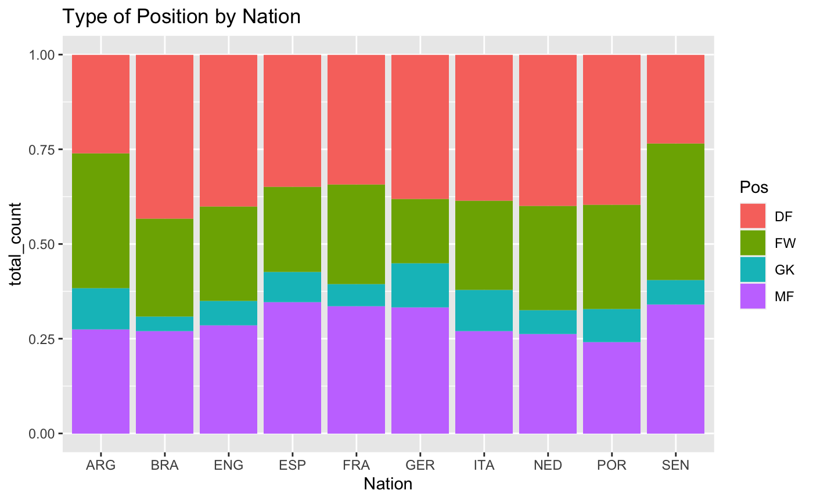
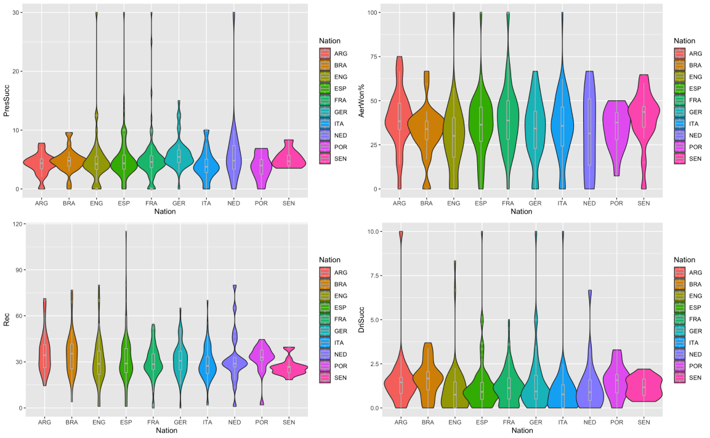
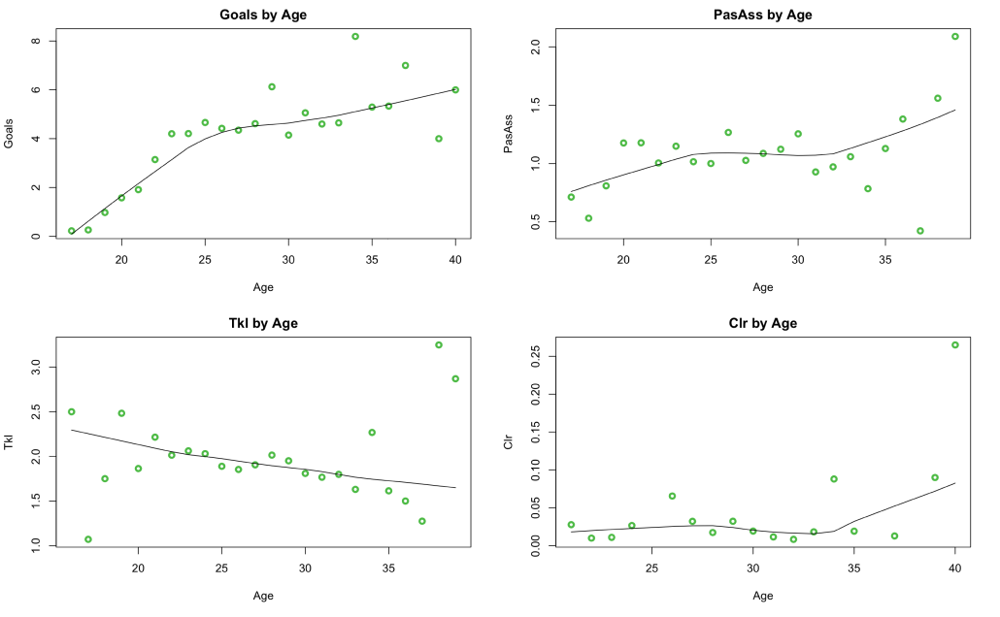

```{r setup, include=FALSE}
knitr::opts_chunk$set(echo = TRUE)
```

# Introduction

L'objectif de ce rapport est de pésenté les resultats de notre analyse sur un dataset contennat les statistiques individuelles des joueur de football évoluant dans les différents cinq championats européens (Premier League, Ligue 1, Bundesliga, Serie A et La Liga).

Le dataset selectionné est disponible sur kaggle en suivant [**ce lien**](https://www.kaggle.com/datasets/vivovinco/20212022-football-player-stats). il contient les statistique de plus de 2500 joueurs avec 143 collonnes contenant un variété de statistique avancées. dont la signification complète est détaillé en annexe.

L'objectif est d'étudier comment la nationalité, l'age affecte le type de profil du joueur. Pour ce faire, nous nous concentrerons sur les statistiques clé suivantes :

-   Pos : Position
-   Goals_tot : Nombre de but total
-   PresSucc : Number of times the squad gained possession withing five seconds of applying pressure
-   GCA : Goal-creating actions
-   Blocks : Number of times blocking the ball by standing in its path
-   Err : Mistakes leading to an opponent's shot
-   Recov : Number of loose balls recovered
-   SoT% : Shots on target percentage (Does not include penalty kicks)
-   PasTotCmp% : Pass completion percentage
-   TklDri% : Percentage of dribblers tackled
-   Press% : Percentage of time the squad gained possession withing five seconds of applying pressure
-   DriSucc% : Percentage of dribbles completed successfully
-   Rec% : Number of times a player successfully received a pass
-   AerWon% : Percentage of aerials won

# Analyse en fonction de la nationalité




Notre data set nous apprend que 103 nationalités différentes sont présentes dans les 5 championats européens majeur. Nous voulons alors voir si un pays produit un type de joeur particuiler. Pour ce faire nous étudions le nombre de jeoueur formé a un poste en fontion de sa nationalité d'origine.


A la lecture de ce graphique, il nous apparrait que ...

Cela peut s'expliqé par ...

Nous pouvons conclure ...




# Analyse en fonction de l'age

Nous voulons voir comment l'age des joueurs affecte leur profils de jeu et voir si le gain d'expériences du à l'age permet de compenser la perte de capacité atlétique en fontion du poste qu'occupe le joueur.





Nous nous apercevons alors que contrairement au idée recu l'age n'affecte pas trop la performance des joueurs,

Il est cependant important de noté que ces donnée corresponde au données des championnat les plus compétitif. où les joueurs qui seraient moins performant en raison de leur age sont exclu progressiveemnt. Autrement dit il n'est normal que les données nous montre de bon score pour les jouer plus ancien car ils correspondent souvent à des top joueurs.


