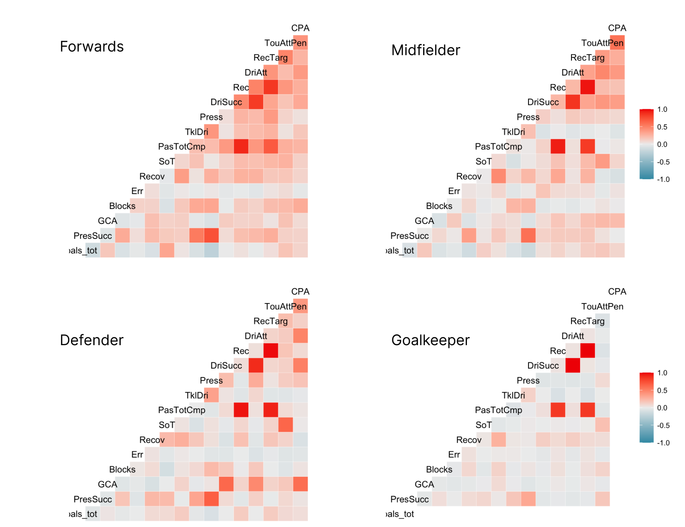
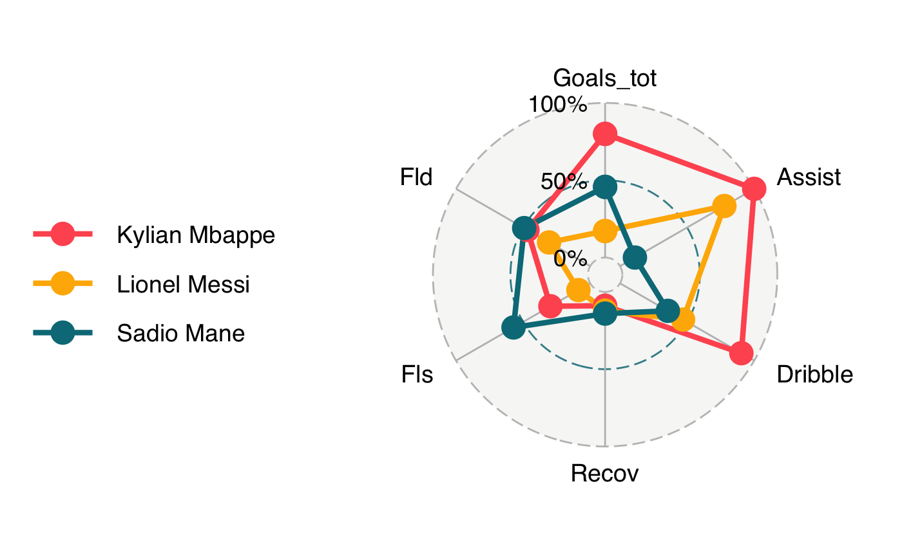

```{r setup, include=FALSE}
knitr::opts_chunk$set(echo = TRUE)
```

# Introduction

L'objectif de ce rapport est de présenté les résultats de notre analyse sur un dataset contenant les statistiques individuelles des joueur de football évoluant dans les différents cinq championnats européens (Premier League, Ligue 1, Bundesliga, Serie A et La Liga).

Le dataset sélectionné est disponible sur kaggle en suivant [**ce lien**](https://www.kaggle.com/datasets/vivovinco/20212022-football-player-stats). Il contient les statistiques de plus de 2500 joueurs avec 143 colonnes contenant une variété de statistique avancées dont la signification complète est détaillé en annexe.

L'objectif est d'étudier comment la nationalité, l'age affecte le type de profil du joueur.

Le lien vers notre projet est disponible à  [**l'adresse suivante**](https://github.com/jodorganistaca/exploratory_analysis_dataviz).

# Analyse en fonction de la nationalité


Notre dataset nous apprend que 103 nationalités différentes sont présentes dans les 5 championnats européens majeur. Nous voulons alors voir si un pays produit un type de joueur particulier. Pour ce faire, nous étudions le nombre de joueurs formé à un poste en fonction de sa nationalité d'origine.


À la lecture de ce graphique, il nous apparaît que certains pays fournissent plus un certain type de joueurs.

* Les joueurs sénégalais évoluant en Europe sont en effet majoritairement des attaquants ou des milieux de terrain, mais très peu souvent des défenseurs.
* Les brésilien au contraire forme plus de défenseur comparé aux autres nationalités là ou nous imaginons souvent un joueur brésilien comme étant un attaquant. Le Brésil fourni en réalité aux championnats européens relativement peu d'attaquant.

Nous voulons également comparer les joueurs en fonction de leur nationalité suivant différentes statistiques.


Nous remarquons que certaines nationalités se distinguent. 

* Les sénégalais dans le jeu aérien et la pression mises sur l'adversaire.
* Les portugais et les brésiliens dans le nombre de dribles réalisé avec succeès.
* Les brésilien et les allemands semble se rendre plus disponible et recevoir légèrement plus de passes.

Ces différences reflètent bien la typologie de jeu des sélections nationales auxquels appartiennent ces joueurs.
Les différences restent cependant relativement faibles, car les joueurs doivent s'adapter au style de jeu des championnats dans lesquels ils évoluent ce qui a tendance à moyenner ces différences.

# Analyse en fonction de l'age

Nous voulons voir comment l'age des joueurs affecte leurs profils de jeu et voir si le gain d'expériences dû à l'âge permet de compenser la perte de capacité athlétique en fonction du poste qu'occupe le joueur.


Nous nous apercevons alors que contrairement aux idées reçu l'âge n'affecte pas trop la performance des joueurs. Le nombre de buts et de passes augmente avec l'âge des joueurs, le nombre de tacles diminue ce qui montre une meilleure lecture du jeu de la part des défenseurs. Concernant le nombre d'arrêts réaliser par les gardiens, ils restent constants.

Il est cependant important de noter que ces données correspondent aux données des championnats les plus compétitif, où les joueurs qui seraient moins performants en raison de leur âge sont exclu progressivement. Autrement dit il n'est normal que les données nous montre de bon score pour les jouer plus ancien, car ils correspondent souvent à des tops joueurs.

# Analyse sur les corelations entre les statistiques



Nous remarquons que les joueurs attaquants ont plus de corrélation entre leurs statistiques offensive et défensives.
Cela nous permet de montrer que les joueurs attaquants s'impliquant plus en défenses vont en général être plus performant sur le plan défensif.

Ce constat est moins vrai pour les joueurs à vocation défensive. Leur qualité de défenseur influe peu sur leur qualité en attaque. Ceci s'explique, car, en dehors de certains profils spécifique, notamment les pistons, les défenseurs ne participent qu'exceptionnellement à la construction offensive.

# Analyse des 'top players'

Dans cette dernière partie, nous souhaitons rappeler les limitations de notre analyse. Il est assez difficile de déduire la qualité d'un joueur suivant ces statistiques. Nous allons pour cela comparer trois des tous meilleurs joueurs du monde : 



Ces trois ont en effet des profils très différents bien qu'étant tous de très grands attaquants.

* Nous remarquons notamment que Sadio Mane se distingue par le nombre de fautes qu'il subit permettant ainsi à son équipe de se créer des nombreuses occasions sur coup de pieds arrêté.

* Kylian Mbappe apparaît véritablement commet un joueur hors normes se distinguant des autres sur presque toutes les statistiques comparé aux autres attaquant notamment par ces statistiques en but et passe décisive. Cependant, il lui reste une marge de progression importante dans son implication défensive aux yeux de nombreux observateurs même si cela ne se reflète pas forcément dans ces statistiques.

* Concernant Lionel Messi, nous pouvons être étonnés par le faible nombre de buts inscrit. Nous reconnaissons cependant le fait qu'il soit un très grand jouer au nombre de passe décisive qu'il arrive à réaliser tous en ayant des statistiques plus faible que les autres dans beaucoup d'autre domaines.

# Conclusion

Ce rapport nous a permis de nous rendre compte que le profil d'un joueur ainsi que sa performance sont généralement en rapport avec sa nationalité et son âge, dont on peut lier ce fait à des enjeux socioéconomiques.

Nous rappelons les limitations, notre dataset ne permet pas vraiment de mettre en évidence des évolutions historiques sur les rendements des différents joueurs puisque les données utilisées sont liées uniquement à l'année 2021-2022.

Il aurait également été intéressant de faire une étude comparative entre les différents championnats majeur européens pour voir si leur style de jeu impacte le profil d'un joueur.
